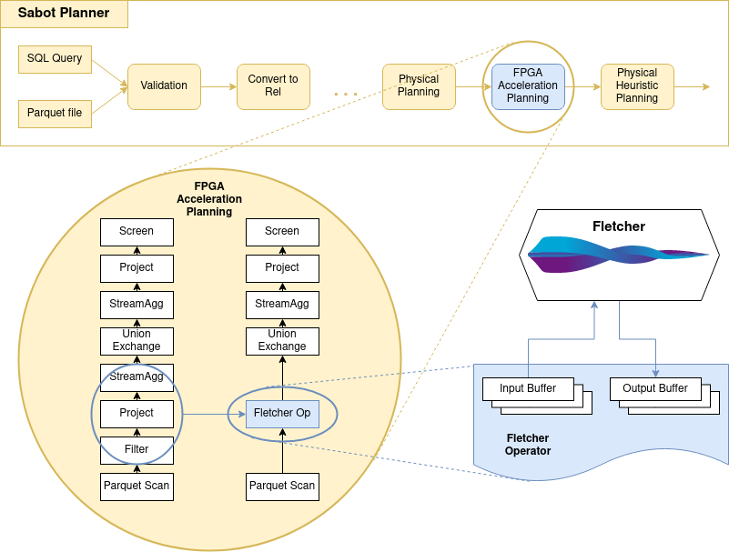

# Dremio Accelerated

*Dremio Accelerated* is an extension of Dremio's Sabot engine which enables the transparent offloading of subqueries to FPGA's. The evaluation of these subqueries is facilitated by [Fletcher](https://github.com/abs-tudelft/fletcher), which decreases the time required to design and implement the required FPGA kernels.

An additional *FPGA Acceleration Planning* phase is added to the Sabot engine, which facilitates rules to target nodes in the physical plan and substitute them by a *Fletcher operator*. This operator exposes it's underlying Arrow buffers to the FPGA and specifies the location to which te results should be written. These extensions can be seen in blue in the figure below.

This illustration is in the context of an example in which an FPGA kernel can evaluate a filter and perform both a project and stream aggregate operation. More detailed illustrations for specific usecases can be seen in the section below.

## Example Usecases

* [Regular expression filter](usecases/regex-filter/README.md) - evaluating a filter operation on FPGA
  
Planned usecases:
* [Filter and StreamAggregate](usecases/filter-streamaggregate/README.md) - (WIP) offloading multiple operators
* [TPC-H Query 6](usecases/tpch-query6/README.md) - (WIP) offloads hashaggregate, project, and filter operators

## Quickstart: How to build and run Dremio Accelerated

Follow the instructions in the [installation guide](Installation.md) to get *Dremio Accelerated* up and running.
