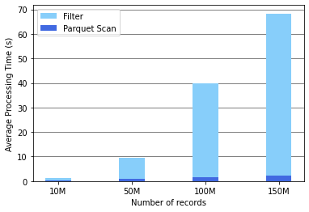
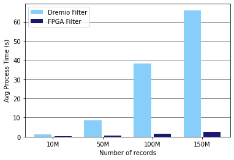

# Usecase: Regular Expression Filter

In this usecase, the evaluation of a regular expression filter is offloaded to an FPGA on an AWS F1 instance.

> :warning: This usecase is currently a work in progress. Content may be incomplete and/or subject to change.

## Background

A SQL query, which includes a regular expression, is run on the 
[Chicago taxi dataset](https://data.cityofchicago.org/Transportation/Taxi-Trips/wrvz-psew). 
The dataset is first converted to parquet such that it can be efficiently read by Dremio. 
The dataset contains 23 columns, but in this usecase we are only interested in the `Trip_Seconds` 
and `Company` columns.

`Trip_Seconds` contains the duration of a given taxi trip in integer values. The `Company` column 
contains the name of the company that carried out the trip as an UTF8 string.

Let's say we are interested in knowing the total duration of all taxi trips as carried out by a company 
whose name matches a specific regular expression. In that case we could construct the following SQL query:

    SELECT SUM(Trip_Seconds) FROM "taxi-trips.parquet" WHERE REGEXP_LIKE(Company, 'YOUR REGEX')

As an example, we consider the following regular expression

    .*[tT][eE][rR][aA][tT][iI][dD][eE][ \t\n]+[dD][oO][lL][pP][hH][iI][nN][ \t\n]+([mM][eE])+[pP][oO][wW][eE][rR].*

Letting the Sabot engine perform it's planning phases for this query, the operators of the physical plan are
given by the figure below.

The filter operator is where this regular expression matching takes place. This can be seen by further inspecting the `condition` property on the filter operator.

    condition = {
        op = "REGEXP_LIKE",
        operands = [
            "$1",
            "\b[a-zA-Z]+\s[a-zA-Z]+\b"
        ],
        type = "BOOLEAN",
        digest = "REGEXP_LIKE($1, '.*[tT][eE][rR][aA][tT][iI][dD][eE][ \t\n]+[dD][oO][lL][pP][hH][iI][nN][ \t\n]+([mM][eE])+[pP][oO][wW][eE][rR].*')"
    }

Such a regular expression filter is quite costly to evaluate on a CPU and can quickly become the bottleneck of the 
evaluation of the entire query. This can be seen in the figure below, in which the average processing time of these
operators is analyzed for the Chicago taxi dataset with a varying amount of records. Only the processing time of the
filter and parquet scan operators is significant enough to show up in the figure.

## Dremio Accelerated Setup

In order to perform the evaluation of the filter on an FPGA, a rule is added to the new *FPGA Acceleration Planning* phase
of the Sabot planner. This rule matches all filters in the physical plan and substitutes them by our Fletcher filter operator.
All initialization parameters of this Fletcher operator can be obtained from the original filter, since all underlying data should
be the same; the difference is in the way the filter is evaluated.

    public class FletcherFilterPrule extends RelOptRule {
      public static final RelOptRule INSTANCE = new FletcherFilterPrule();
    
      // Match on any filter prel
      private FletcherFilterPrule() {
        super(RelOptHelper.any(FilterPrel.class), "FletcherFilterPrule");
      }
    
      @Override
      public void onMatch(RelOptRuleCall call) {
        final FilterPrel  filter = (FilterPrel) call.rel(0);
        call.transformTo(new FletcherFilterPrel(
          filter.getCluster(),
          filter.getInput().getTraitSet(),
          filter.getInput(),
          filter.getCondition()
        ));
      }

    }

With this rule, it can be seen that the filter operator is substituted for the Fletcher filter operator at the end of 
the *FPGA Acceleration Planning* phase.

In theory, an FPGA can process regular expression a lot faster than any CPU implementation. A naive comparison can be
seen in the figure below. This figure does however not tell the complete story.

The major difference is that FPGAs prefer to work on large record batches, minimizing the overhead related to setting up memory
transfers and maximizing the time spent processing the data. On the other hand, big data frameworks tend to keep their
record batches small such that processing can be parallelized easier when working on a cluster.

In the case of Dremio, the default record batch size of a narrow batch (batches with less than 100 fields, such as in 
our example) is set to 4 095 records. This batch size can be increased, but the maximum value is limited to 64 000 records.
For now, this value is therefore increased manually to 64 000 records. 

In a future version, the `FletcherFilterPrule` in the *FPGA Acceleration Planning* phase will schedule additional 
operators in front of and after the Fletcher operator, which increase and decrease the record batch sizes respectively.
In this way, the framework maintains its original scalability while at the same time enabling FPGA accelerators to process
the record batches more efficiently.

## Results

TODO: remark about AWS DMA

Setting the input batch size for the FPGA regex kernel to 64 000, the kernel processes the batch in 0.002001 seconds.
Using a back-of-the-envelope calculation, it can be seen that in the case of 150M records there are approximately 2 344
record batches. Therefore, the Fletcher filter operator should be able to process all batches in approximately 4.69 seconds,
resulting in a 14x speedup as compared to the Dremio filter operator.

Multiple efforts are being made to increase this speedup even further and as such this usecase is still a work in progress.
These efforts are listed below.
* Align input buffers to 64 bytes instead of 8 bytes to increase DMA write speed
* Increase batch size for the Fletcher operator only instead of the entire pipeline
